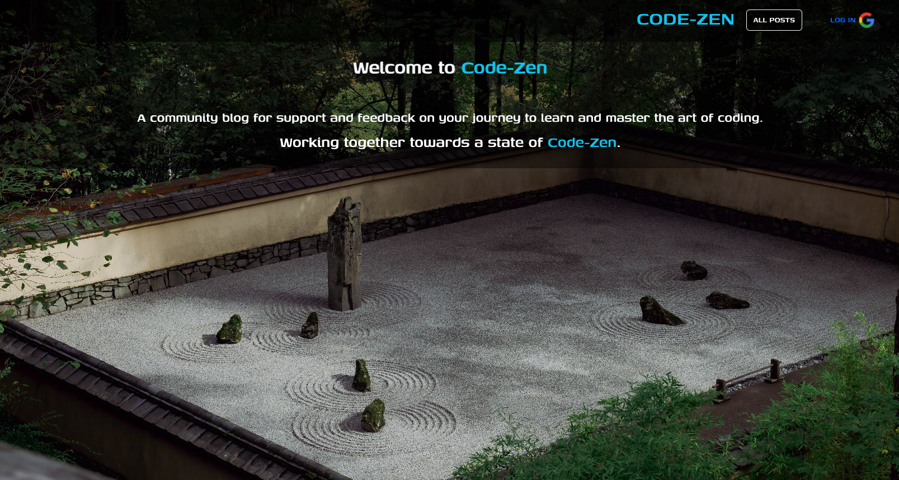
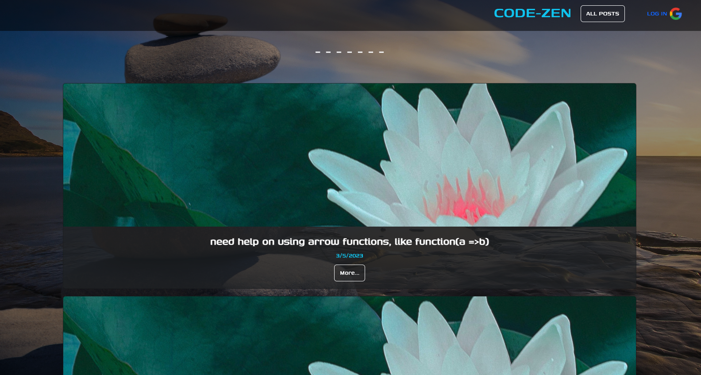
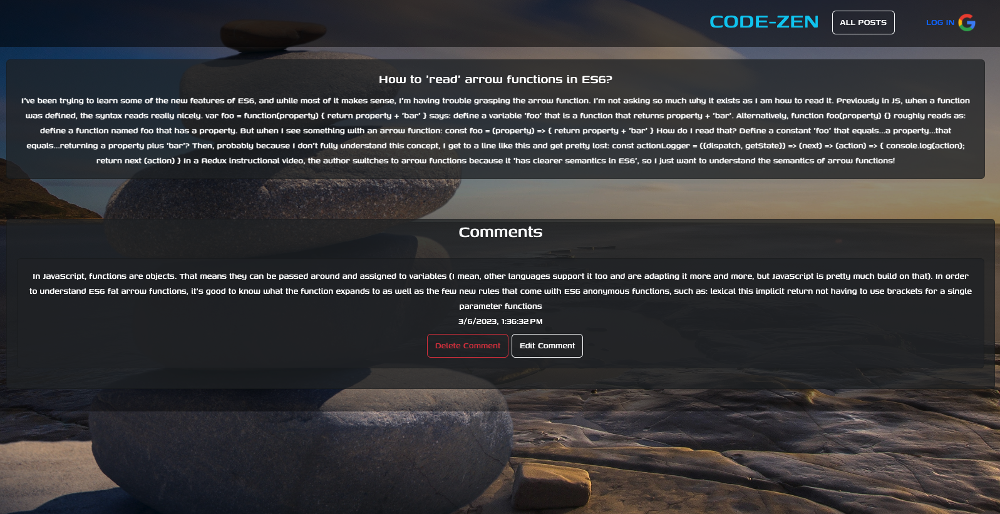

# code-zen

"Code-Zen: Community Coding Support Blog"

[https://code-zen.herokuapp.com/]
[https://trello.com/b/wYGHdvZQ/project-2-learning-to-code-blog]

This is intended to be a community blog focused around helping people find support on their journey 
toward learning programming. It is meant to be a a place where new programmers can find support
through skill specific or process based questions, answered by the other community members.

Technologies used:

-Javascript
-MongoDB
-NodeJS
-Mongoose
-OAuth
-Passport
-HTML/CSS
-Bootstrap

Getting started:

You can click the "All Posts" link on the nav bar to view community posts. From there, you can click the "More" button 
on a post to see comments and feedback from the community. You can log-in with your google credentials to join the
community. This allows you to make and edit posts, as well as make and edit comments on community posts.

Next steps / Ice-Box items:

-Fix bug where user names are not displayed on posts and comments
-Integrate highlight.js to more clearly display code blocks in posts and comments
-Integrage 3rd party api to display zen koans on landing page
-Add markdown functionality 
-UI refinement